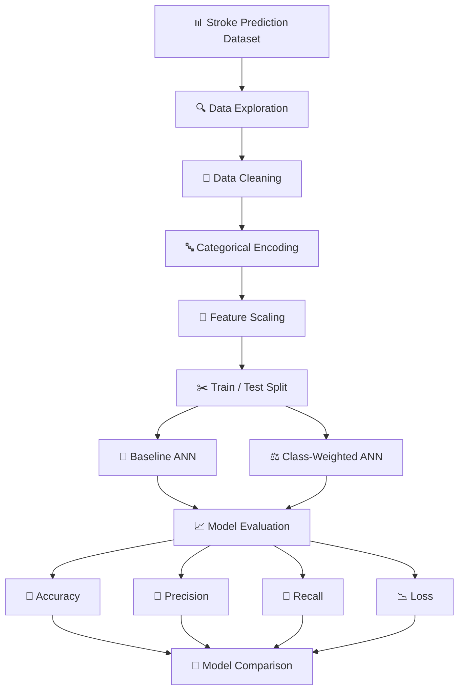
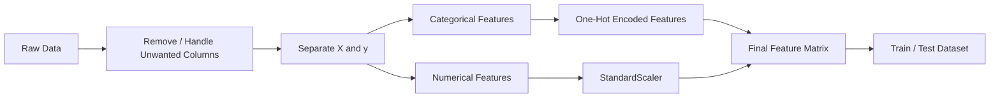
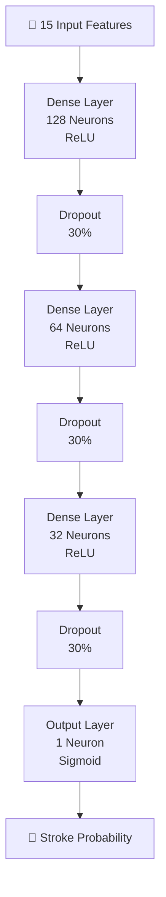
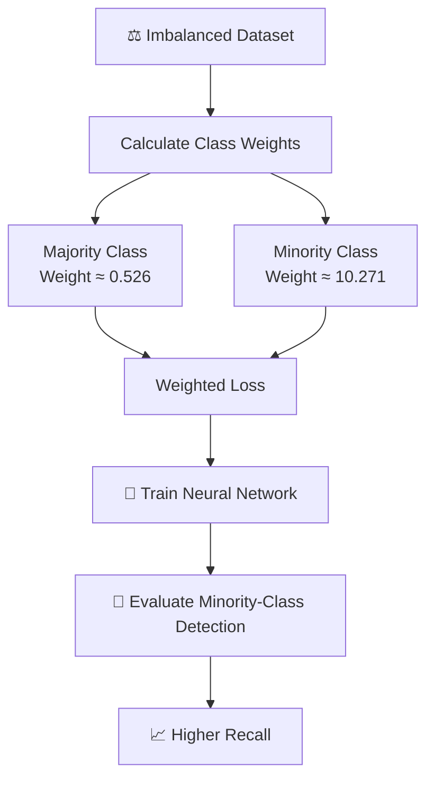
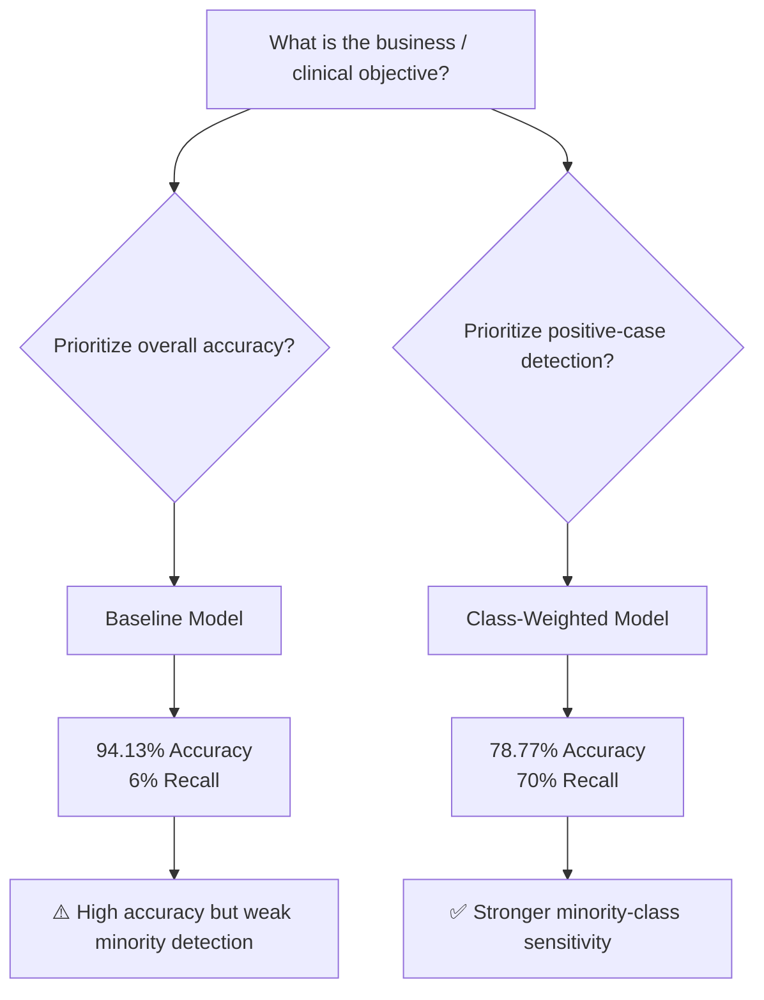
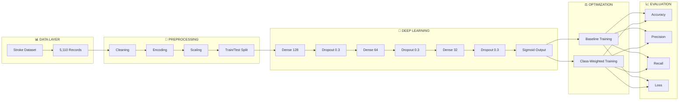
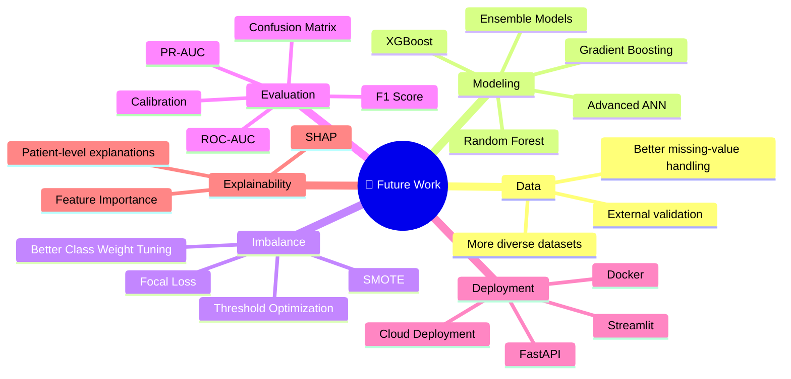

# 🧠 Stroke Prediction using Deep Learning

<p align="center">
  
  
  
  
  
</p>

<p align="center">
  <b>🫀 A Deep Learning approach for predicting stroke risk from patient health and demographic attributes.</b>
</p>

<p align="center">
  <i>From raw healthcare data → preprocessing → neural network → class-imbalance optimization → evaluation</i>
</p>

---

## 🚀 Project Overview

Stroke prediction is a **binary classification problem** where the objective is to estimate whether a patient belongs to the `stroke = 0` or `stroke = 1` class.

This project develops a **fully connected Artificial Neural Network (ANN)** using TensorFlow/Keras and evaluates two training strategies:

1. 🔹 **Baseline Neural Network**
2. ⚖️ **Class-Weighted Neural Network**

The second approach was introduced because the dataset contains a strong class imbalance. The notebook therefore explores the trade-off between **overall accuracy** and the ability to detect the minority stroke class.

> ⚠️ **Medical Disclaimer:** This project is an educational/research prototype and is **not a medical diagnostic system**. Predictions should not be used for clinical decisions.

---

# 🧭 End-to-End Pipeline



---

# 📊 Dataset

The notebook downloads the **Stroke Prediction Dataset** using KaggleHub and loads:

`healthcare-dataset-stroke-data.csv`

The dataset contains:

* **5,110 patient records**
* **12 original columns**
* Demographic information
* Health conditions
* Lifestyle information
* Stroke target variable

### 🧬 Feature Set

| Feature             | Description             |
| ------------------- | ----------------------- |
| `id`                | Patient identifier      |
| `gender`            | Patient gender          |
| `age`               | Patient age             |
| `hypertension`      | Hypertension indicator  |
| `heart_disease`     | Heart disease indicator |
| `ever_married`      | Marriage status         |
| `work_type`         | Employment category     |
| `Residence_type`    | Urban/Rural residence   |
| `avg_glucose_level` | Average glucose level   |
| `bmi`               | Body Mass Index         |
| `smoking_status`    | Smoking category        |
| `stroke`            | 🎯 Target variable      |

---

# 🔎 Dataset Analysis

The original dataset contains **5,110 observations** and the `bmi` column contains missing values, with **4,909 non-null BMI values**. The notebook also shows that only about **4.87% of records belong to the positive stroke class**, demonstrating the central class-imbalance challenge.

### ⚠️ Class Imbalance

```text
Stroke = 0  █████████████████████████████████████████████  ~95.1%

Stroke = 1  ██                                           ~4.9%
```

This imbalance is extremely important.

A model can achieve high accuracy simply by predicting the majority class most of the time.

Therefore:

> **Accuracy alone is not enough.**

For a medical-risk classification problem, **Recall for the positive class becomes particularly important**.

---

# 🧹 Data Preparation

The preprocessing pipeline follows this structure:



The notebook performs an **80/20 train-test split** with stratification and scales the numerical features:

* `age`
* `avg_glucose_level`
* `bmi`

The resulting split contains:

* `X_train`: **4,088 samples**
* `X_test`: **1,022 samples**
* **15 input features** after encoding.

---

# 🧠 Neural Network Architecture

The project uses a **Sequential Feed-Forward Neural Network**.



### 🏗️ Architecture Details

| Layer   | Units | Activation | Purpose                |
| ------- | ----: | ---------- | ---------------------- |
| Input   |    15 | —          | Patient features       |
| Dense   |   128 | ReLU       | Feature representation |
| Dropout |   30% | —          | Regularization         |
| Dense   |    64 | ReLU       | Deeper representation  |
| Dropout |   30% | —          | Regularization         |
| Dense   |    32 | ReLU       | Compact representation |
| Dropout |   30% | —          | Regularization         |
| Output  |     1 | Sigmoid    | Binary probability     |

## The implemented network contains **12,417 trainable parameters**.

# ⚙️ Training Configuration

```text
Framework        → TensorFlow / Keras
Architecture     → Sequential ANN
Optimizer        → Adam
Learning Rate    → 0.001
Loss Function    → Binary Crossentropy
Epochs           → 50
Batch Size       → 32
Validation Split → 20%
Dropout          → 30%
```

The model tracks:

* 📈 Accuracy
* 🎯 Precision
* 🔎 Recall
* 📉 Binary Crossentropy Loss

---

# 🧪 Experiment 1 — Baseline Model

The first experiment trains the neural network without class weighting.

### 📊 Test Performance

| Metric       |     Result |
| ------------ | ---------: |
| 📉 Test Loss | **0.2289** |
| 🎯 Accuracy  | **94.13%** |
| 🎯 Precision | **18.75%** |
| 🔎 Recall    |  **6.00%** |

### 💡 Interpretation

The baseline model achieves impressive **94.13% accuracy**, but its **6% recall** reveals a major weakness.

In other words, the model struggles to identify many actual stroke-positive cases.

This is a classic consequence of severe class imbalance.

---

# ⚖️ Experiment 2 — Class-Weighted Neural Network

To address the imbalance, the notebook calculates class weights and trains another neural network using them.

The calculated weights were approximately:

```text
Class 0 → 0.526
Class 1 → 10.271
```

The minority stroke class therefore receives substantially greater training importance.

### ⚙️ Weighted Training Pipeline



---

# 📊 Baseline vs Weighted Model

| Metric    |   Baseline | Class Weighted |
| --------- | ---------: | -------------: |
| Accuracy  | **94.13%** |     **78.77%** |
| Precision | **18.75%** |     **14.77%** |
| Recall    |  **6.00%** |     **70.00%** |
| Loss      | **0.2289** |     **0.3943** |

### 🔥 The Key Finding

The results demonstrate a fundamental machine-learning trade-off:

```text
                    BASELINE
                       │
                       ▼
              ┌─────────────────┐
              │  High Accuracy   │
              │     94.13%      │
              └────────┬────────┘
                       │
                       ▼
              ❌ Recall = 6%
              Misses many positives


                    WEIGHTED
                       │
                       ▼
              ┌─────────────────┐
              │  Lower Accuracy │
              │     78.77%      │
              └────────┬────────┘
                       │
                       ▼
              ✅ Recall = 70%
              Better positive detection
```

For an imbalanced medical-risk classification task, this is a much more meaningful comparison than simply choosing the model with the highest accuracy.

---

# 📈 Model Decision Framework



---

# 🧩 Technology Stack

<p align="center">

| Technology          | Purpose                           |
| ------------------- | --------------------------------- |
| 🐍 **Python**       | Core programming                  |
| 🐼 **Pandas**       | Data manipulation                 |
| 🔢 **NumPy**        | Numerical computation             |
| 📊 **Matplotlib**   | Visualization                     |
| 🤖 **TensorFlow**   | Deep learning framework           |
| 🧠 **Keras**        | Neural network API                |
| ⚙️ **Scikit-learn** | Preprocessing & dataset splitting |
| ☁️ **KaggleHub**    | Dataset acquisition               |
| 📓 **Google Colab** | Development environment           |

</p>

---

# 🔄 Complete ML Architecture



---

# 📁 Project Structure

```text
📦 Stroke-Prediction
│
├── 📓 Stroke_Prediction.ipynb
├── 📄 README.md
│
├── 📊 healthcare-dataset-stroke-data.csv
│
├── 📈 assets/
│   ├── training-history.png
│   ├── model-architecture.png
│   └── confusion-matrix.png
│
└── 📜 requirements.txt
```

---

# ▶️ Getting Started

## 1️⃣ Clone the Repository

```bash
git clone https://github.com/<your-username>/Stroke-Prediction.git
cd Stroke-Prediction
```

## 2️⃣ Install Dependencies

```bash
pip install pandas numpy matplotlib scikit-learn tensorflow kagglehub
```

## 3️⃣ Launch the Notebook

```bash
jupyter notebook Stroke_Prediction.ipynb
```

Or open it directly in **Google Colab**.

---

# 🧪 Reproduce the Experiment

```python
import tensorflow as tf
from tensorflow.keras.models import Sequential
from tensorflow.keras.layers import Dense, Dropout
from tensorflow.keras.optimizers import Adam
from tensorflow.keras.metrics import Precision, Recall

model = Sequential([
    Dense(128, activation="relu", input_shape=(X_train.shape[1],)),
    Dropout(0.3),

    Dense(64, activation="relu"),
    Dropout(0.3),

    Dense(32, activation="relu"),
    Dropout(0.3),

    Dense(1, activation="sigmoid")
])

model.compile(
    optimizer=Adam(learning_rate=0.001),
    loss="binary_crossentropy",
    metrics=["accuracy", Precision(), Recall()]
)

history = model.fit(
    X_train,
    y_train,
    epochs=50,
    batch_size=32,
    validation_split=0.2
)
```

---

# 📈 What This Project Demonstrates

### 🧠 Deep Learning

* Building a feed-forward ANN
* Dense layers
* ReLU activation
* Sigmoid binary classification
* Dropout regularization
* Adam optimization

### 🧹 Data Engineering

* Dataset exploration
* Missing-value analysis
* Categorical encoding
* Feature scaling
* Stratified train/test splitting

### ⚖️ Machine Learning Strategy

* Class imbalance
* Class weighting
* Accuracy vs recall trade-off
* Minority-class optimization

### 📊 Model Evaluation

* Accuracy
* Precision
* Recall
* Loss
* Training/validation curves
* Comparative model analysis

---

# 🧠 Key Learning

> **A high accuracy score does not automatically mean a good classifier.**

This experiment is a practical demonstration of why **dataset distribution and evaluation metrics matter**.

The baseline model achieved **94.13% accuracy**, but only **6% recall**. After applying class weighting, recall increased dramatically to **70%**, while accuracy decreased to **78.77%**.

That makes this project more than just a neural-network implementation — it is an exploration of **how model objectives change when the minority class actually matters**.

---

# 🚧 Limitations

This project is an experimental deep-learning implementation and has several limitations:

* ⚠️ The dataset is strongly imbalanced.
* ⚠️ Precision remains relatively low.
* ⚠️ The model is trained on a relatively small tabular dataset.
* ⚠️ No external clinical validation is performed.
* ⚠️ Model probability thresholds are not extensively optimized.
* ⚠️ The notebook is not intended for real-world medical diagnosis.
* ⚠️ Additional feature engineering and model comparison could improve the study.

---

# 🔮 Future Improvements



---

# 🌟 Research Direction

The next stage of this project could evolve from:

```text
📓 Notebook
     ↓
🧪 Experiment
     ↓
📊 Model Benchmarking
     ↓
⚖️ Imbalance Optimization
     ↓
🔍 Explainable AI
     ↓
🌐 API
     ↓
🖥️ Web Application
     ↓
🚀 Production Research Prototype
```

---

# 👨‍💻 Author

<p align="center">

### **Aravind**

🎓 Student | 🤖 AI/ML Developer | 🧠 Deep Learning Enthusiast

</p>

<p align="center">
  <i>Building intelligent systems, one experiment at a time.</i>
</p>

---

# ⭐ Support

If you found this project useful:

⭐ **Star the repository**

🍴 **Fork the project**

🐛 **Open an issue**

💡 **Suggest an improvement**

🤝 **Contribute**

---

<p align="center">

### 🧠 Learn → Experiment → Evaluate → Improve → Deploy 🚀

**Built with Python + TensorFlow + Curiosity ❤️**

</p>
